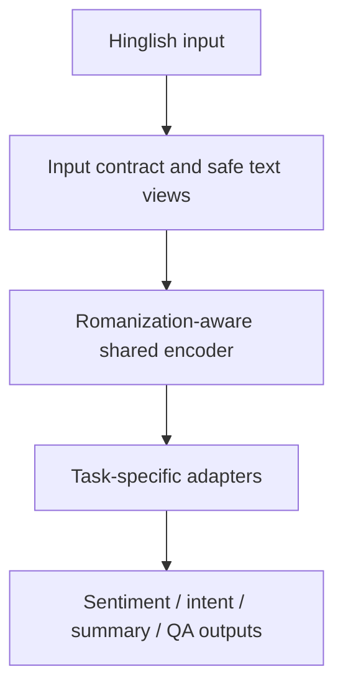
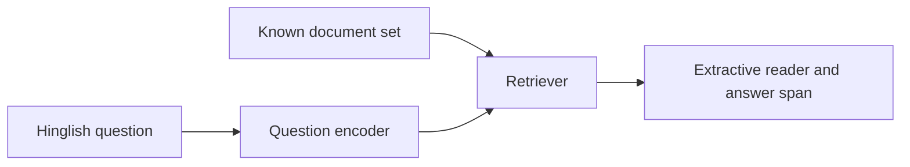

# Roman Indic NLU: Hinglish Architecture

Status: design freeze for Phase 1 implementation

## 1. Scope

This project targets Romanized Hindi-English (Hinglish) text. It does not
claim to solve every South Asian code-mixed language. The four task endpoints
are:

1. three-way sentiment classification;
2. Hinglish query-intent classification;
3. Hinglish dialogue to English summarization;
4. extractive/retrieval question answering.

The system is designed around the problem statement's constraints: spelling
drift, code mixing, slang, typos, emojis and punctuation must remain visible to
the model, while the deployable models must be compact and measurable at
batch-size-one latency.

## 2. Design principles

- Preserve the original message. Normalization creates an additional view; it
  never replaces the raw text.
- Do not use an LLM to generate the main training corpus.
- Keep public benchmark data, human-collected challenge data and synthetic
  augmentation in separate partitions.
- Split by writer or source conversation where the metadata permits it.
- Report macro-F1 and per-condition results, not only one aggregate score.
- Use a closed-book or extractive QA reader before attempting free-form
  generation.
- Treat released checkpoints as baselines. A checkpoint is not our research
  contribution.

## 3. System overview



Every endpoint receives an explicit task name. There is no generative LLM
router deciding which task to run.

## 4. Shared language layer

### 4.1 Input contract

Each request contains:

```json
{
  "task": "sentiment | intent | summarization | qa",
  "text": "raw Romanized Hinglish text",
  "conversation_id": "optional identifier",
  "context": "optional QA context"
}
```

The pipeline records a versioned preprocessing configuration and model hash in
every prediction log.

### 4.2 Safe text views

The preprocessor creates three views:

1. **Raw view**: Unicode-normalized only with emojis, punctuation, casing,
   repeated characters, URLs and mentions preserved as meaningful signals.
2. **Orthographic view**: conservative cleanup of whitespace and obvious URL or
   user-ID tokens. It must not silently translate Hindi words or remove emoji.
3. **Phonetic view**: a character-level representation that makes spelling
   variants comparable. It is built from explicit character/phoneme rules and
   human spelling pairs; it is not an LLM-generated rewrite.

The model receives raw plus phonetic views. The orthographic view is used for
diagnostics and ablations.

### 4.3 Representation and tokenizer

The first deployable representation is byte/character based, because it is
robust to unseen spellings and does not require a closed Hindi vocabulary. A
small subword vocabulary may be trained from the L3Cube-HingCorpus and our
task text for comparison, but no language-model weights are fine-tuned on that
corpus in Phase 1.

The encoder has:

- a byte/character embedding layer;
- a shallow character convolution for local spelling patterns;
- a compact Transformer encoder for context;
- gated fusion of raw and phonetic representations;
- shared pooled representation `z` for classification and retrieval.

The final parameter count and batch-size-one latency are measured on CPU and
GPU. They are not inferred from the model name.

### 4.4 Robustness objective

Where human-written paired variants are available, the training objective adds
a consistency term:

```text
classification_loss(raw, label)
+ classification_loss(variant, label)
+ lambda * distance(z_raw, z_variant)
```

For emoji-flip pairs, the labels are intentionally different and the
consistency term is not applied. This prevents the model from learning that
all spelling changes or all emojis are interchangeable.

## 5. Task branches

### 5.1 Sentiment

Input: one Hinglish sentence or message.

Output:

```json
{
  "label": "positive | neutral | negative",
  "probabilities": {"positive": 0.0, "neutral": 0.0, "negative": 0.0},
  "confidence": 0.0
}
```

Data: the supplied 14k/3k/3k Hinglish split. The provided test labels remain
locked until final evaluation. The exact train/test duplicate already found
must be excluded from training and documented.

Baselines:

- character n-gram logistic regression;
- word/subword linear model;
- compact multilingual encoder;
- raw-only versus raw-plus-phonetic encoder.

Metrics: macro-F1, per-class F1, calibration error, per-language-token-mix
bucket, spelling-drift accuracy and emoji-flip accuracy.

### 5.2 Intent classification

Intent is not substituted with NLI. The initial taxonomy will be a small,
human-defined customer-support taxonomy (approximately 10--15 labels):
cancellation, refund, delivery delay, missing item, damaged item, payment
failure, account issue, product information, complaint, greeting and other.

Training data must be human-written Hinglish or explicitly licensed source
data. Question-type classification data can be reported as an auxiliary
benchmark, but it will not be renamed as general intent classification.

The same encoder and a new classification head are used. Macro-F1 and a
confusion matrix are required because the taxonomy will be imbalanced.

### 5.3 Summarization

Input: a multi-turn Hinglish conversation.

Output: an English summary plus factuality flags.

Data: GupShup Hinglish-to-English (`h2e`) source/target files, subject to the
dataset's access and usage terms.

The released `midas/gupshup_h2e_*` checkpoints are reproducibility baselines.
The final deployable branch will be a smaller encoder-decoder or a constrained
extractive-abstractive model distilled and measured against those baselines.

Decoding constraints:

- maximum input turns/tokens;
- maximum summary length;
- beam or constrained sampling chosen before test evaluation;
- no external web retrieval;
- no unsupported facts introduced into the summary.

Metrics: ROUGE-1/2/L, BERTScore, factuality/coverage checks, human adequacy,
human fluency, parameter count and generation latency.

### 5.4 Question answering

The first QA version is retrieval plus extractive reading:



The answer must be an extracted span or an explicit `no_answer`; the system
does not invent an answer when the context does not support one.

Data: the Hinglish portion of the Code-Mixed QA Challenge, followed by a small
human-reviewed domain knowledge base for demonstration. GLUECoS QA is an
additional benchmark, not a replacement for a controlled QA evaluation.

Metrics: exact match, token F1, no-answer accuracy, retrieval recall@k and
answer-support rate.

## 6. Training and evaluation lifecycle

### Stage A: data audit

- parse source-specific formats;
- preserve original IDs and provenance;
- check label counts and malformed rows;
- detect exact and normalized duplicates;
- freeze test files and hashes;
- produce a data card before training.

### Stage B: representation preparation

- fit the byte/character pipeline on training text only;
- optionally train a subword tokenizer using permitted unlabeled Hinglish
  text;
- create spelling and emoji challenge sets without leaking them into training.

### Stage C: baseline reproduction

Run simple linear and released-checkpoint baselines first. Save predictions,
metrics, environment details and latency measurements.

### Stage D: shared encoder and task heads

Train sentiment first. Add the intent head only after the sentiment data
pipeline is stable. Add the summarization and QA branches with their own
dataset-specific collators and metrics.

### Stage E: deployment optimization

- distill only after accuracy and robustness are established;
- apply dynamic/int8 quantization where it does not damage emoji or spelling
  robustness;
- benchmark batch size one, p50 and p95 latency;
- publish model size, memory use and hardware details.

## 7. Repository boundaries

```text
data/raw/                 # downloaded data, never committed by default
data/processed/           # validated, derived files with manifests
src/rinlu/preprocess/     # raw/orthographic/phonetic views
src/rinlu/tasks/          # sentiment, intent, summarization, QA
src/rinlu/evaluation/     # metrics, challenge sets, leakage checks
configs/                  # versioned task configurations
reports/                  # reproducible metric and error reports
```

Raw social-media datasets stay outside the public repository unless their
terms explicitly permit redistribution. The repository contains download
instructions, checksums and schema validators instead.

## 8. What makes this genuine

The contribution is the combination of:

1. a transparent Romanization-aware representation;
2. human-written spelling and emoji robustness evaluation;
3. writer/source-disjoint leakage-safe splits;
4. four task-specific branches with honest task boundaries;
5. reproducible speed, memory and failure analysis.

We will not claim that a pretrained checkpoint, a synthetic corpus or a
frontend alone solves the problem.
