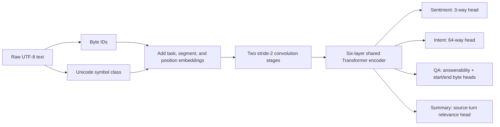
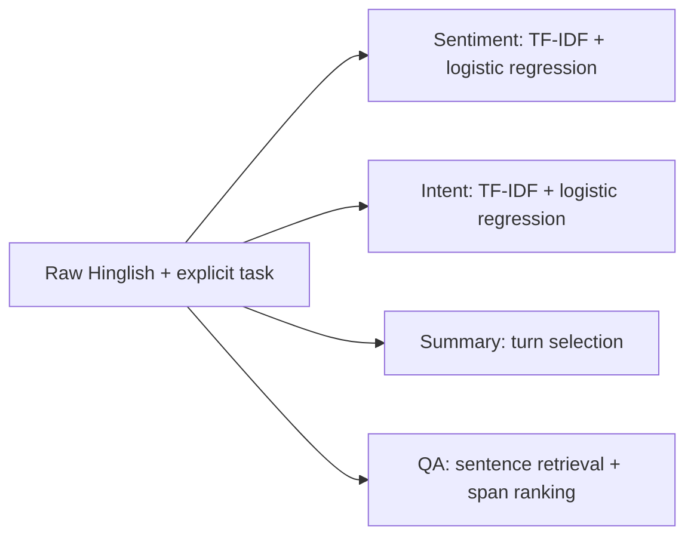

# Technical design: a from-scratch byte model for Hinglish NLU

## Constraint decision

The problem states a **maximum** of 500M parameters; it does not require a model
near that limit. Existing pretrained weights and fine-tuning are excluded from
the final solution. The final model starts with random weights.

A 400M random model is a poor fit for the available corpus and single-digit-ms
CPU target. The implemented candidate has **4.30M parameters** and one shared
encoder. Sentiment and intent are classifications; QA predicts source byte spans;
summarization selects source turns. No task performs autoregressive decoding.



The byte vocabulary has 264 entries: 256 UTF-8 byte values and eight reserved
IDs. NFC is the only text normalization. Case, repeated letters, emoji, and
punctuation remain in the input. A second embedding records whether each Unicode
character is a letter, number, separator, punctuation mark, symbol/emoji, mark,
or other character. Each byte belonging to a multi-byte character receives the
same symbol class.

Two depthwise convolution stages reduce sequence length fourfold before global
self-attention. Six encoder layers use width 256, eight heads, and a 768-wide
feed-forward block. For QA, encoder states are interpolated back to byte length
and fused with the original byte embeddings. Non-context positions are masked
before start/end selection. The predicted byte offsets can therefore be checked
against the supplied source rather than accepting generated text.

The initial eager-PyTorch smoke benchmark on this machine measured 4.84 ms p95
for a 32-byte sentiment input and 9.80 ms p95 for a 256-byte QA input with one CPU
thread. A 512-byte QA input measured 19.07 ms p95, so the serving design must first
retrieve a relevant passage and cap the neural reader at 256 bytes. These are
untrained engineering measurements, not quality results. Summary must pass its
own p95 gate after turn retrieval, export, and quantization.

## Training without existing model weights

1. Freeze test splits and remove normalized duplicates before any fitting.
2. Initialize every neural parameter randomly with the recorded seed.
3. Train masked-byte reconstruction on allowed train text only. Select complete
   Unicode characters and corrupt all their UTF-8 bytes together, so a multibyte
   emoji or Indic character is never half-selected. The original bytes remain the target.
4. Add supervised task batches from human-labelled train splits. Continue joint
   optimization of the same model; no external checkpoint is loaded.
5. Measure deterministic vowel deletion and letter repetition as development
   diagnostics. A clean/noisy consistency loss remains an unrun ablation; it is
   not part of the reported trained checkpoint.
6. Select architecture and loss weights on development data. Open each test split
   once for the final report.
7. Export ONNX, apply dynamic int8 quantization, and benchmark batch-one p50/p95/p99
   including byte encoding and output construction.

The implemented joint objective sums masked-byte cross entropy, sentiment cross
entropy, class-aware intent cross entropy, and QA start/end cross entropy. The
answerability and summary heads exist in the graph but cannot receive supervised
loss until matching human labels are available. Missing task labels do not become
guessed labels: unlabelled rows contribute only to masked-byte reconstruction.

The pretraining sampler interleaves sources instead of uniformly sampling the
largest corpus. It includes train-only SentiMix, Hinglish-TOP, and CMQA text;
PHINC Hinglish; the public anonymized `saidutta69/Gupshup` chat corpus; and
redacted private chats. Normalized development/test text is excluded before
sampling. The public Gupshup chat corpus is distinct from the request-only
GupShup h2h summarization benchmark and supplies no summary supervision.

## Hugging Face dataset audit

Hugging Face is a distribution host, so its metadata does not replace the original
paper or license. Candidate revisions are pinned before download and their files
are hashed locally.

| Dataset | Core use | Decision |
|---|---|---|
| [RTT1/SentiMix](https://huggingface.co/datasets/RTT1/SentiMix) | Sentiment | Use the existing human train/dev/test mirror; confirm original redistribution terms. |
| [WillHeld/hinglish_top](https://huggingface.co/datasets/WillHeld/hinglish_top) | Intent | Use human rows and upstream Apache-2.0 source; exclude generated augmentation. |
| [LingoIITGN/PHINC](https://huggingface.co/datasets/LingoIITGN/PHINC) | Masked-byte pretraining and transliteration robustness | Use its 13,738 human Hinglish-English pairs under CC BY 4.0. |
| [festvox/cmu_hinglish_dog](https://huggingface.co/datasets/festvox/cmu_hinglish_dog) | Dialogue-domain pretraining | Optional; keep provenance flags because the card describes machine-generated annotation. |
| [ai4bharat/IndicCMix](https://huggingface.co/datasets/ai4bharat/IndicCMix) | Synthetic spelling/code-mixing ablation | Optional and reported separately; never mix into the human test set. |
| [BobbleAI/BHSD](https://huggingface.co/datasets/BobbleAI/Bobble-Hinglish-Sports-Dataset_BHSD) | Out-of-domain intent test | Evaluation only; its CC BY-NC-ND license prevents modified redistribution. |
| `ankitdhiman/hinglish-conversations` | Possible pretraining | Exclude until license and generation provenance are documented. |
| `Yugrathee28/Hinglish-dataset` | Possible labels | Exclude: only a restricted teaser is public and broader training needs permission. |

Private WhatsApp messages remain local. They may contribute to masked-byte
training after redaction and deduplication, but their derived checkpoint must not
be published without participant consent. They do not provide sentiment, intent,
QA, or summary labels.

## Acceptance gates

- Unique parameters below 500,000,000, counted from the saved graph.
- No pretrained checkpoint path in configuration or training manifests.
- Macro-F1 for sentiment and intent; exact match/token-F1 for QA; ROUGE plus a
  small human factuality check for summaries.
- Natural spelling and emoji-flip contrast sets remain blind until evaluation.
- Warm batch-one p95 below 10 ms for each declared input length on the target CPU.
- Report long-input latency separately instead of extrapolating from short text.

The model is in `src/rinlu/neural.py`, training is in
`scripts/train_from_scratch.py`, and ONNX/int8 export plus measurement is in
`scripts/export_byte_model.py`. Fixed architecture settings are in
`configs/byte_multitask.json`.

## Current trained baselines

The problem permits one or several downstream tasks. This implementation includes
all four requested tasks with explicit boundaries:

- Sentiment: negative, neutral, or positive.
- Intent: the outer intent label from human Hinglish-TOP semantic parses.
- Summarization: select source turns/sentences; output remains Hinglish.
- QA: select an answer span from supplied text; no external retrieval at inference.

These baseline artifacts do not use the new shared neural encoder. Sentiment and intent share a feature-building
function but fit separate vocabularies and classifiers. QA and summarization share
sentence-offset and overlap utilities. The PNG from the original design describes
a proposed neural system, not this implementation.



## Why character features

Romanized Hindi has no single spelling standard. A word-only vocabulary treats
`bahut` and `bohot` as unrelated tokens. Character n-grams can retain partial
matches between variants such as `delivery` and `deliverry`. They do not guarantee
that all phonetic equivalents map together.

A character 3-gram is a window of three characters. `nahi` contributes `nah` and
`ahi`. Sliding windows also include spaces, emoji and punctuation. TF-IDF turns
the counts into a sparse numeric vector. Only a small fraction of all vocabulary
entries occur in any one message, which makes linear prediction fast.

For an n-gram g in message d, the implementation uses:

```text
tf(g,d)  = 1 + log(count(g,d))       when count > 0
idf(g)   = log((1 + N)/(1 + df(g))) + 1
x(g,d)   = tf(g,d) * idf(g), then normalize x to unit L2 length
```

N and document frequencies come from training text only. Character vocabulary
coverage is different from n-gram coverage: a known character can still occur in
an unseen 3-gram. Neither guarantees semantic understanding.

Four candidates compare character-only, word+character, raw+canonical character,
and character+explicit symbol features. The canonical view folds case, reduces
long repeated letters, and normalizes spacing; raw text remains available in that
candidate. The raw TF-IDF view also lowercases by the vectorizer default, so it
does not preserve capitalization as a learned distinction.

The explicit symbol channel keeps Unicode punctuation/symbol code points and
uses 1–3 grams. This retains single emoji that the main 3–5 gram channel may miss.
It is an ablation candidate, not proof of sarcasm understanding. Keeping an emoji
in a feature vector is weaker than interpreting its pragmatic effect correctly.

## Classification, one operation at a time

For each label k, logistic regression learns weights w[k] and bias b[k]:

```text
score[k] = dot(w[k], x) + b[k]
p[k]     = sigmoid(score[k])
```

Each one-vs-rest model learns whether a training message belongs to its label.
Class balancing increases the loss weight of examples from rare labels. L2
regularization discourages very large weights; C controls inverse regularization
strength. Scikit-learn normalizes the one-vs-rest probabilities across labels.
These probabilities are not automatically calibrated confidence guarantees.

Fit four candidates on train. Compare macro-F1 on development data. Among models
within 0.002 of the best dev macro-F1, choose the lowest measured p95 latency.
The current model remains fitted on train only, preserving the dev split for
independent inspection. The older sentiment experiment refitted on train+dev;
its scores must not be mixed with this protocol.

Hinglish-TOP provides task-oriented labels such as CREATE_ALARM and SEND_MESSAGE.
Extracting the outer `[IN:...]` tag is actual intent classification; we do not
rename domains, question types, or NLI labels into support intents. The taxonomy
is not a customer-support taxonomy. Rare labels and unseen labels need separate
attention even when overall accuracy is high.

## QA: retrieval and span ranking

1. Split supplied context into sentences, retaining original character offsets.
2. Rank sentences by question-word coverage plus character-trigram coverage.
3. Enumerate contiguous spans of 1–8 words in the top three sentences.
4. Score each candidate using a small Ridge regression model.
5. Return the highest-scoring candidate and its exact source offsets.

The first ten features are sentence word coverage, character coverage, normalized
span length, whether the span contains a number, initial capitalization, all-caps,
span/question overlap, relative start position, and stop-word indicators at each
end. Twenty more features combine five question-type indicators with numeric,
capitalization, acronym, and length features. The five types are quantity, time,
person, location, and abbreviation/full-form questions, detected with small
English/Hindi question-word patterns.

For speed, each token's properties are calculated once. A prefix sum stores the
running total; subtracting the totals at a span's two boundaries gives its counts.
NumPy computes these differences for all spans together. The optimized version
produces exactly the same features as the original per-span loops.

Targets during training are token-F1 between each candidate and the human answer.
Ridge learns a regularized linear approximation to those targets. All partially
matching candidates and at most 100 zero-overlap distractors are used per question.
Each question receives equal total weight. Gold answers are used only to build
training targets; inference receives only question and context.

This is a deliberately small lexical reader, not deep language understanding.
It can fail when a correct answer lies outside the retrieved sentences, is longer
than eight words, needs reasoning, or has no lexical link to the question. The
score is a ranking value, not a probability. Empty context, zero question overlap,
or a score below the configured threshold returns `no_answer`. No-answer quality
is unverified because this filtered corpus has no human-labelled unanswerables.
A returned source span is evidence of extraction, not evidence it answers correctly.

## Summarization: extraction rather than generation

1. Keep full speaker turns when newline or `<br>`/`<sep>` separators exist;
   otherwise split sentences while keeping offsets.
2. Hash character 3–5 grams into a fixed 16,384-column sparse representation.
3. Calculate pairwise cosine similarity between normalized sentence vectors.
4. Rank sentences and penalize selecting text too similar to an already chosen turn.
5. Return up to three sentences and 80 whitespace-delimited words in source order.

The unfitted mode scores sentences by mean similarity to the dialogue: a simple
centrality baseline. With GupShup h2h, Ridge learns from six features: centrality,
length, position, first-turn flag, last-turn flag, and question-mark presence.
The target is lexical ROUGE-1 F1 between a source sentence and the human summary.
This target is a proxy for importance, not an independently annotated sentence label.

Selection maximizes `importance - 0.4 * similarity_to_selected`. Copying text
preserves spelling, emoji and punctuation, but can omit context, speaker links,
negation in another turn, or an important short reply. If no full sentence fits
the word budget, the output explicitly marks a truncated source prefix. There is
no English translation and no claim of abstractive summarization.

## Data integrity and reproducibility

Sentiment comes from the SentiMix mirror at a pinned revision. Converting its LF
line endings to CRLF reproduces all four original SHA-256 values. Preparation
repairs recoverable mojibake and removes normalized duplicates. The current
loader writes a separate sentiment_current directory and preserves old manifests.
Train/dev overlaps are removed from train; dev/test overlaps are removed from dev.

Intent uses only the human portion of Hinglish-TOP. Duplicate normalized queries
are removed with test taking priority over dev and train. This reduces the nominal
training set substantially and is recorded in the report. Writer IDs are absent,
so we do not claim writer-disjoint evaluation.

QA starts with the original CMQA training release. Exclude other languages,
image/general/missing contexts, and answers that are not contiguous case-insensitive
spans. Deduplicate question/context pairs. Shuffle complete context groups with
seed 42 and assign 70/15/15 percent of groups to train/dev/test. This is a custom,
filtered benchmark, not the official CMQA or GLUECoS leaderboard split. It is very
small and not representative enough to support strong generalization claims.

GupShup must be obtained through the authors' request process. No training or test
summaries have been fabricated. A loader checks aligned source/target line counts,
nonempty rows, and normalized cross-split duplicate dialogue text.

Each current training report stores split hashes, source audit, configuration,
package versions, parameter counts, and a source-code fingerprint. A test command
rejects data whose split hashes differ from the saved training bundle. Source data
and answer-containing prediction outputs remain ignored by Git.

## Metrics and latency

Classification reports accuracy, macro-F1, and per-class precision/recall/F1.
Macro-F1 gives each label equal weight, exposing weak rare classes that accuracy
can hide. QA reports normalized token exact match and multiset token-F1. Summary
reports ROUGE-1/2/L F1 with explicit lowercase word tokenization, without stemming;
these are lexical overlap metrics, not semantic or factuality metrics.

Warm batch-one CPU timing includes preprocessing, model computation, and output
construction. It excludes process startup, artifact loading, networking, and file
I/O. Inputs are spread across the split, with warm-up and one BLAS thread. Report
p50/p95/p99 and sequential throughput. Sequential throughput is not concurrent
server throughput. Full artifacts and learned scalar counts are reported; TF-IDF
IDF values are included in addition to classifier weights and intercepts.

Classification accepts nonblank inputs up to 2,000 characters. QA accepts up to
1,000 question and 12,000 context characters. Summary accepts up to 12,000 characters
and 128 turns/sentences. These are input limits, not worst-case latency guarantees.
Measured sub-10-ms performance on a benchmark does not guarantee the same speed on
every allowed input or other hardware.

## Robustness and remaining evidence

Deterministic vowel deletion and letter repetition are synthetic stress tests.
They modify one eligible word and do not establish invariance to natural slang,
all typos, or all phonetic variations. For QA they perturb the question, leaving
context unchanged. Emoji and punctuation removal are semantic input ablations;
using the old label after removal is a diagnostic, not proof of correct semantics.
Reports compare changed examples with the exact same examples before modification.

The human contrast protocol freezes pair text and model hashes before annotation,
uses two blind annotators and third-person adjudication, and reports pair accuracy,
flip sensitivity, directional flip accuracy, and pair-bootstrap confidence intervals.
An empty CSV cannot produce that evidence. Historical preregistration hashes refer
to older artifacts; freeze new hashes before collecting labels for this run.

To defend the work, explain: the representation and why it is fast; the source of
each label; the split boundary; the candidate selection rule; exact timing scope;
and a real failure case. Do not claim a trained summarizer without GupShup, reliable
QA from a handful of test questions, support-domain coverage from TOP, or pragmatic
emoji understanding before the human study.

## Sources

- [CANINE tokenization-free encoder](https://aclanthology.org/2022.tacl-1.5/)
- [ByT5 byte-to-byte models](https://aclanthology.org/2022.tacl-1.17/)
- [Frozen SAIL-2017 mBERT comparison](https://huggingface.co/rohanrajpal/bert-base-multilingual-codemixed-cased-sentiment)
- [SentiMix task paper](https://aclanthology.org/2020.semeval-1.100/)
- [Hinglish-TOP source and license](https://github.com/google-research-datasets/Hinglish-TOP-Dataset)
- [CMQA source, README and COPYING](https://github.com/khyathiraghavi/code_switched_QA)
- [PHINC human parallel corpus](https://huggingface.co/datasets/LingoIITGN/PHINC)
- [Public anonymized Gupshup chat corpus](https://huggingface.co/datasets/saidutta69/Gupshup)
- [GupShup source and access request](https://github.com/midas-research/gupshup)
- [Scikit-learn TF-IDF documentation](https://scikit-learn.org/stable/modules/generated/sklearn.feature_extraction.text.TfidfVectorizer.html)
- [Scikit-learn Ridge documentation](https://scikit-learn.org/stable/modules/generated/sklearn.linear_model.Ridge.html)
